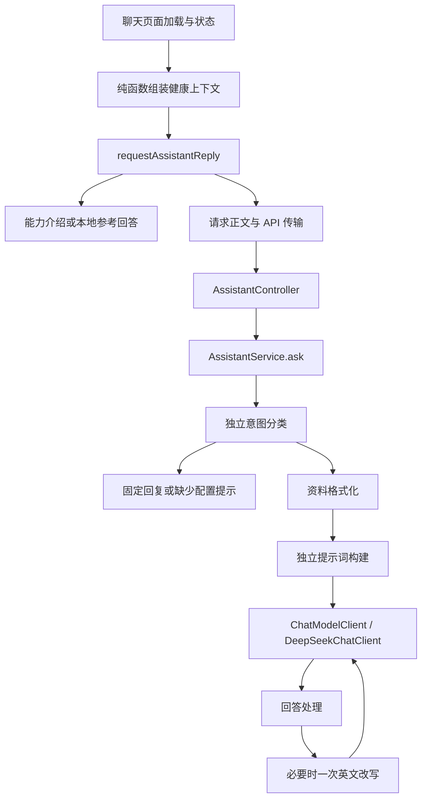

# AI 链路与分阶段版本

本轮从 `62128d0` 拆分现有实现，保留接口和行为。当前资料由前端传入，服务端没有知识库检索、多轮记忆、流式输出或工具调用。

## 前后端职责

前端页面加载健康档案、健康记录、饮食和三个目标的资料，通过 `features/assistant/context.ts` 组装上下文。原 `api/assistant.ts` 继续提供 `requestAssistantReply(question, context): Promise<string>`：能力介绍优先本地返回，否则按模式调用 API；API 抛错时使用带服务失败标记的本地参考回答，成功但没有回答时保持原不带失败标记的兜底。

后端组件和接口在 `back_end/src/main/java/com/example/ipd_sp_back_end/assistant/`。`AssistantService` 只协调问题检查、分类、提前返回、格式化、生成提示词、调用模型、处理回答和异常包装。组件使用构造器注入，不保存请求级共享状态。

前端模块职责见[助手模块 README](../health-management-frontend/src/features/assistant/README.md)，后端模块职责见[AI 架构说明](../back_end/docs/AI_ARCHITECTURE.md)。

## 后续升级位置

| 需求 | 接入位置 |
| --- | --- |
| 用语义分类替换关键词/正则 | 实现 `AssistantIntentClassifier` 并替换注入的规则实现；保持能力、范围外、健康三类结果及返回优先级 |
| 升级模型提示词或模板版本 | `AssistantPromptBuilder`；通过 `AssistantPrompt(systemPrompt, userPrompt)` 交给模型接口，与分类实现独立 |
| 更换模型提供方 | 实现 `ChatModelClient` 的 `isConfigured()` 和 `complete(AssistantPrompt)`，保留协调入口 |
| 扩展健康资料 | 前端 `types.ts`、`context.ts` 及后端 `AssistantContextFormatter` |
| 修改本地回复和建议问题 | 前端 `localReplies.ts`、`rules.ts`，后端固定文案在 `AssistantReplyCatalog` |

本轮原规则与提示词原样迁移。前端 API 能力判断、页面建议判断、后端分类的原有差异继续保留；升级时可以分别测试和调整。

## 兼容约定

- `/api/assistant/chat` 请求仍为 `message`、`language`、`context`、`constraints`，成功为 `{answer}`，错误正文结构与 HTTP 400/500 保持。后端仅 `zh-CN` 进入中文分支，其他语言值沿用英文默认。
- `assistant.deepseek.base-url`、`model`、`api-key` 仍按原配置绑定；`DEEPSEEK_API_KEY` 仅后端读取。模型客户端连接超时 20 秒、单次调用超时 60 秒、温度 0.4；前端请求超时 60 秒。
- 中文不执行英文改写；英文回答含汉字时最多额外调用一次，第二次仍有汉字时不循环，改写失败沿用错误处理。
- 资料格式、空值占位、目标顺序与零值保留；七天记录统计保持原仅检查下界的行为。最新记录按日期降序选取，排序不修改原数组。
- 页面数据加载、复制、编辑重发、关联删除、整段删除保持。存储键继续为 `smart-assistant-chat-history-v2:<账号范围>`，保存最近 80 条消息；聊天历史不进入模型请求。

## 迭代与发布

每个阶段从上一阶段合并后的 `origin/main` 创建分支，测试和前后端构建通过后自审差异、凭据和临时文件，推送、创建独立 PR，检查通过后以 merge commit 合并。保留已发布历史，后续修复使用新提交或回退提交。

| 阶段 | 分支 | PR | 里程碑 |
| --- | --- | --- | --- |
| 行为基线 | `codex/ai-baseline` | [#1](https://github.com/XiubaiZero/MakeUHealth/pull/1) | 带注释标签 [v0.1.0](https://github.com/XiubaiZero/MakeUHealth/releases/tag/v0.1.0) 指向 `62128d0` |
| 后端规则 | `codex/ai-backend-rules` | [#2](https://github.com/XiubaiZero/MakeUHealth/pull/2) | 分类、回复、资料和提示词模块 |
| 后端链路 | `codex/ai-backend-client` | [#3](https://github.com/XiubaiZero/MakeUHealth/pull/3) | [v0.1.1](https://github.com/XiubaiZero/MakeUHealth/releases/tag/v0.1.1) |
| 前端请求 | `codex/ai-frontend-request` | [#4](https://github.com/XiubaiZero/MakeUHealth/pull/4) | 类型、规则、回复和传输模块 |
| 完整链路 | `codex/ai-frontend-context` | [#5](https://github.com/XiubaiZero/MakeUHealth/pull/5) | [v0.1.2](https://github.com/XiubaiZero/MakeUHealth/releases/tag/v0.1.2) |

版本变更见[CHANGELOG](../CHANGELOG.md)。

## 验证

最终前端 33 项测试、后端 16 项测试及两端生产打包通过。后端另有 4 项真实数据库测试，未配置独立 `HMS_TEST_DATABASE_URL` 时跳过。

前端测试使用 Node 与现有 TypeScript 转译能力加载真实模块依赖图，只替换 API 客户端和语言状态边界。后端使用本地模拟 HTTP 服务及模拟超时，验证路径、鉴权、模型参数、提示词、状态错误、无效 JSON、空回答、英文改写和并发隔离；Spring 测试验证完整组件注入和原配置绑定。

最终生产构建在 Edge 中以模拟 API 数据验证能力介绍和建议、健康资料与目标切换、中英文切换、编辑重发、复制、关联删除、失败兜底、刷新恢复、整段删除、80 条存储上限和账号历史隔离。浏览器验证与模型回归均不访问付费模型；这些结果不代表执行了真实数据库或 DeepSeek 在线联调。
